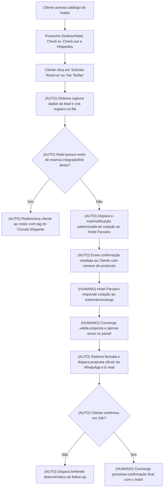

# 1. Cabeçalho

* **Empresa:** Verde Serra Central Hoteleira LTDA (Marca comercial: Circuito Elegante)
* **Processo master:** Solicitação, Cotação e Conversão de Reservas Hoteleiras (B2C)
* **Vídeos-fonte:** `Gravação de Tela 2026-08-25 às 18.05.52.mov` (Duração: 01:53)
* **Arquivos de contexto usados:** Diagnóstico DMO / Respostas de Diagnóstico Operacional (`Manoela Poroger / Verde Serra Central Hoteleira`)
* **Data:** 25 de agosto de 2026

---

# 2. Objetivo do sistema

O processo atual da Verde Serra Central Hoteleira apresenta um gargalo crítico de tempo de resposta: o cliente preenche parâmetros de reserva no portal institucional e é transferido para o WhatsApp comercial, onde a solicitação depende de triangulação 100% manual entre o concierge interno e o hotel parceiro. Essa fricção resulta em um SLA de retorno de 48 a 72 horas, além da inoperância fora do horário comercial (segunda a sexta, das 9h às 17h), gerando perda direta de conversões para canais concorrentes (OTAs e venda direta dos próprios hotéis).

O objetivo do sistema reformado é **sistematizar e automatizar a captura, roteamento, cotação e acompanhamento de reservas B2C**, reduzindo o tempo de resposta inicial de 48 horas para instantes (ou direcionamento imediato para compra), eliminando a digitação redundante de dados e criando uma central estruturada de atendimento para os concierges operarem exceções e suporte consultivo de alto padrão.

* **Público-alvo / Papéis atendidos:** 
  1. *Cliente Final B2C (Hóspede de Alta Renda):* Realiza buscas, obtém cotações imediatas ou links diretos de reserva e acompanha status.
  2. *Concierge / Equipe Comercial:* Opera fila unificada de atendimento para casos especiais, consultoria de experiências e follow-ups de alta conversão.
  3. *Gestão Comercial / Marketing:* Acompanha métricas de conversão de leads, receita gerada e SLAs de atendimento por hotel parceiro.

## 2.1 Resumo da entrega

Será entregue um **Portal de Reservas e Central de Gestão de Atendimento (Hub de Cotação)**. A solução moderniza o fluxo do site para realizar captura direta e estruturada de leads, integração determinística de direcionamento a motores de reserva dos hotéis parceiros ou disparo automatizado e padronizado de solicitações de cotação para as propriedades, munindo a equipe interna de um painel de controle operacional com fila de prioridades e réguas automáticas de acompanhamento, eliminando a dependência do atendimento manual para a simples checagem de tarifas.

---

# 3. Visão geral do fluxo reformado

### Comparativo As-Is $\rightarrow$ To-Be:

* **ELIMINAR:** 
  * *Redirecionamento cego para WhatsApp sem registro estruturado de lead (00:54 - 01:25)* — Justificativa: Causa perda de contexto, depende de ação manual do cliente no navegador e dispersa os dados de contato.
  * *Consulta manual do concierge via telefone/e-mail para hotéis com motor de reserva disponível (01:31)* — Justificativa: Desperdício puro (NVA); a reserva ou cotação direta pode ser disparada via link parametrizado ou formulário estruturado.
* **AUTOMAÇÃO DETERMINÍSTICA:**
  * *Captura de dados e criação de lead estruturado:* O formulário do site grava os dados de intenção de reserva no painel do concierge no ato da busca.
  * *Roteamento determinístico por parceiro:* Se o hotel parceiro possui motor de reserva online, o sistema gera o link de reserva direta com o cupom/tag de benefícios do Circuito Elegante; se o hotel opera apenas por cotação manual, o sistema dispara a requisição padronizada para o setor de reservas do hotel e envia confirmação imediata de protocolo ao hóspede.
  * *Régua de Follow-up de Cotação:* Mensagens automáticas determinísticas para o cliente após envio da proposta (ex.: após 24h sem resposta).
* **MANTER HUMANO:**
  * *Atendimento consultivo e personalização de experiências:* Casos que exigem conciliação de datas especiais, grupos ou roteiros gastronômicos complexos continuam sendo atendidos pelo concierge, porém com painel unificado com histórico e contexto completo do cliente.

### Diagrama do Fluxo Reformado (To-Be Base)

---

# 4. Funcionalidades

### F01. Formulário de Captura Direta e Validação de Intenção
* **O que faz:** Captura nome, e-mail, WhatsApp, hotel de interesse, período (check-in/check-out) e total de hóspedes diretamente na interface web antes do redirecionamento.
* **Para quem:** Cliente B2C.
* **Dor que resolve:** Fricção no redirecionamento do WhatsApp Web (00:54) e perda de dados do cliente sem registro prévio.
* **Rota:** Automação Determinística.

### F02. Roteador de Disponibilidade e Link Direto de Parceiro
* **O que faz:** Avalia a regra do hotel parceiro selecionado. Se o hotel suportar reserva direta, redireciona o cliente para o link direto de compra com os parâmetros pré-preenchidos e identificador do Circuito Elegante.
* **Para quem:** Cliente B2C e Gestão de Vendas.
* **Dor que resolve:** SLA de 48 horas para hotéis que possuem disponibilidade pública imediata (01:31).
* **Rota:** Automação Determinística.

### F03. Hub de Cotações e Notificações Padronizadas B2B
* **O que faz:** Para hotéis sem link direto, o sistema gera e envia automaticamente uma ordem de cotação estruturada para o e-mail/canal oficial de reservas do hotel parceiro no momento do envio do formulário, contendo os detalhes padronizados.
* **Para quem:** Hotel Parceiro e Concierge.
* **Dor que resolve:** Digitação manual da solicitação pelo Concierge após receber WhatsApp (01:31).
* **Rota:** Automação Determinística.

### F04. Painel de Gestão de Solicitações do Concierge (Fila Unificada)
* **O que faz:** Exibe as cotações pendentes organizadas por status (`Aguardando Retorno do Hotel`, `Proposta Pronta para Envio`, `Em Negociação`, `Concluída`), com contadores de SLA visualmente destacados (alertas de atraso).
* **Para quem:** Concierge / Equipe Comercial.
* **Dor que resolve:** Risco de esquecimento em conversas soltas no WhatsApp corporativo e falta de rastreio de prazos (01:28, 01:31).
* **Rota:** Apoio a etapa humana.

### F05. Gerador de Proposta Comercial Padronizada
* **O que faz:** Interface onde o Concierge insere o valor e condições informadas pelo hotel parceiro, gerando uma mensagem/cartão visual de proposta com botão de aceite rápido para envio via WhatsApp corporativo e e-mail.
* **Para quem:** Concierge e Cliente B2C.
* **Dor que resolve:** Formatação manual e heterogênea de propostas por texto livre (01:31).
* **Rota:** Apoio a etapa humana.

### F06. Régua de Acompanhamento e Follow-up Automático
* **O que faz:** Dispara mensagens programadas determinísticas para o cliente caso uma proposta enviada não receba resposta após 24 e 48 horas úteis.
* **Para quem:** Cliente B2C e Concierge.
* **Dor que resolve:** Falta de follow-up pós-cotação apontada no diagnóstico DMO (pontuação 0 em automações).
* **Rota:** Automação Determinística.

---

# 5. Regras de negócio

* **RN-01 — Bloqueio de Período Inválido:** `[REGRA ATUAL OBSERVADA - 00:38]` A data de check-out deve ser obrigatoriamente posterior à data de check-in, com permanência mínima de 1 diária.
* **RN-02 — Horário de Operação Humana:** `[REGRA ATUAL OBSERVADA - 01:28]` O expediente humano do concierge ocorre de segunda a sexta-feira, das 9h às 17h. Solicitações recebidas fora desse horário recebem mensagem automática com estimativa exata de abertura do atendimento.
* **RN-03 — SLA Máximo de Resposta B2B:** `[PROPOSTA]` Toda solicitação de cotação enviada ao hotel parceiro que não for respondida em até 12 horas úteis deve gerar um alerta visual vermelho no painel do concierge para cobrança ativa.
* **RN-04 — Priorização de Roteamento de Hotéis:** `[PROPOSTA]` Se o cadastro do hotel parceiro tiver a flag `reserva_online_habilitada = Verdadeiro`, o botão `Reservar` deve abrir diretamente o ambiente de checkout do parceiro com parâmetros de rastreamento do Circuito Elegante.
* **RN-05 — Confirmação Imediata de Solicitação (Anti-Abandono):** `[PROPOSTA]` Ao enviar o pedido de cotação no site, o cliente deve receber em até 60 segundos uma mensagem via WhatsApp/E-mail confirmando o número da solicitação e os dados recebidos.

---

# 6. Automações

### Automação A01 — Captura e Despacho Imediato de Cotação
* **Gatilho:** Cliente clica em `Solicitar Cotação` no formulário web.
* **Regra:** Se todos os campos obrigatórios estiverem preenchidos e o hotel não possuir motor de reservas direto, gravar registro no painel e disparar notificação com dados da reserva para a caixa postal de reservas do Hotel Parceiro.
* **Resultado:** Criação do chamado no Hub de Concierge e e-mail enviado ao hotel parceiro sem intervenção manual.
* **O que era manual:** Concierge lia mensagem no WhatsApp, abria e-mail ou discava para o hotel para repassar os dados (01:31).
* **Ganho esperado:** Eliminação de 15 a 30 minutos de trabalho manual por solicitação; envio instantâneo.

### Automação A02 — Roteamento Direto para Canal Transacional
* **Gatilho:** Cliente seleciona hotel com integração de motor e clica em `Reservar`.
* **Regra:** Se `hotel.tipo_integracao == DIRETA`, montar URL parametrizada com check-in, check-out, hóspedes e código de parceiro do Circuito Elegante.
* **Resultado:** Cliente cai direto na tela de pagamento/escolha de quarto do hotel.
* **O que era manual:** Triangulação completa de 48 horas (01:31).
* **Ganho esperado:** Conversão imediata em menos de 2 minutos.

### Automação A03 — Régua de Lembrete e Follow-up de Reserva
* **Gatilho:** Proposta comercial marcada como `Enviada ao Cliente` há 24 horas sem alteração de status para `Fechada` ou `Cancelada`.
* **Regra:** Se o horário atual estiver entre 9h e 17h em dia útil, disparar mensagem padronizada no WhatsApp do cliente perguntando se restou alguma dúvida.
* **Resultado:** Lead reengajado de forma determinística.
* **O que era manual:** Inexistente (diagnóstico DMO acusou pontuação zero em follow-up).
* **Ganho esperado:** Recuperação de até 20% das cotações esquecidas.

*(Para evolução com assistência de inteligência artificial sobre esta etapa, ver Seção 9).*

---

# 7. Fluxos do usuário

### 7.1 Jornada do Cliente Final B2C
1. **Página do Hotel / Catálogo:** O cliente visualiza as comodidades do hotel e preenche os campos: Check-in, Check-out, Quantidade de Hóspedes, Nome, E-mail e Telefone.
2. **Confirmação:** O cliente clica no botão de ação.
   * *Cenário Link Direto:* O cliente é direcionado imediatamente à página de checkout do hotel com os benefícios do selo aplicados.
   * *Cenário Cotação sob Consulta:* O cliente visualiza uma tela de confirmação com número de protocolo e recebe confirmação instantânea no WhatsApp.
3. **Recebimento da Proposta:** O cliente recebe a proposta formatada com link para aceite ou ajuste.

### 7.2 Jornada do Concierge
1. **Painel de Atendimento:** O concierge abre a visualização da fila de atendimentos do dia.
2. **Triagem de Retornos de Hotéis:** Ao receber o e-mail/retorno com os valores do hotel parceiro, clica no registro do cliente no painel.
3. **Composição da Proposta:** O concierge preenche os campos: Valor da Diária, Taxas, Categoria de Quarto e Condições Especiais.
4. **Disparo:** Clica em `Gerar e Enviar Proposta`. O sistema gera a comunicação padronizada para o WhatsApp do cliente.
5. **Fechamento:** Ao receber a confirmação de compra do cliente, clica em `Marcar como Reserva Confirmada`.

---

# 8. Dados e informações necessárias

| Campo / Informação | Origem | Destino / Exibição |
|---|---|---|
| `Nome do Hotel/Destino` | Seleção do usuário (Autocompletar) | Painel do Concierge, Notificação ao Hotel |
| `Data de Check-in` | Input do usuário (Data) | Painel do Concierge, Mensagem ao Hotel |
| `Data de Check-out` | Input do usuário (Data) | Painel do Concierge, Mensagem ao Hotel |
| `Quantidade de Hóspedes` | Input do usuário (Dropdown) | Painel do Concierge, Mensagem ao Hotel |
| `Nome Completo do Cliente` | Input do formulário web | Cadastro de Leads, Painel do Concierge |
| `WhatsApp do Cliente` | Input do formulário web | Disparo de mensagens e Follow-up |
| `E-mail do Cliente` | Input do formulário web | Cadastro e régua de cotação |
| `Canal de Notificação do Hotel` | Cadastro do Hotel no Sistema | Roteador de Notificações B2B |
| `Status da Cotação` | Calculado pelo Sistema / Ação do Usuário | Painel do Concierge (Filtros de Fila) |
| `Valor da Proposta (R$)` | Input do Concierge | Proposta Comercial ao Cliente |
| `Link de Checkout Parceiro` | Cadastro do Hotel no Sistema | Botão de Reserva Direta |

---

# 9. Evoluções sugeridas com IA (opcional — fora do escopo base)

*Nota: O sistema base detalhado nas seções anteriores é 100% determinístico e opera perfeitamente sem nenhuma dependência de IA.*

### Evolução IA-01: Extrator de Cotações de E-mail de Hotéis Parceiros
* **Etapa de origem:** Recepção da resposta do setor de reservas do hotel parceiro (Seção 4 - F03 / Seção 7.2).
* **Tipo:** IA Generativa Pontual.
* **O que ganharia:** Leitura automática do e-mail de resposta do hotel, extração determinística dos valores (diária, taxas, categoria do quarto) e pré-preenchimento do formulário de proposta no painel do concierge.
* **Trade-off:** Custo por requisição de processamento de texto e necessidade de validação humana do valor extraído antes do envio da proposta ao cliente.

### Evolução IA-02: Agente Concierge 24h para Qualificação e Dúvidas Frequentes
* **Etapa de origem:** Atendimento no canal de WhatsApp fora do horário comercial (01:28).
* **Tipo:** Agente de IA Conversacional.
* **O que ganharia:** Atendimento em linguagem natural durante noites e finais de semana para tirar dúvidas sobre a estrutura dos hotéis parceiros (ex.: "O hotel aceita pets?", "Possui piscina aquecida?"), coletar parâmetros detalhados de viagem e deixar a cotação pronta para confirmação.
* **Trade-off e Limites do Agente:**
  * *Objetivo:* Esclarecer dúvidas institucionais e registrar parâmetros de reserva.
  * *Limites estritos:* O agente não tem alçada para confirmar reservas, negociar descontos ou processar pagamentos.
  * *Ponto de supervisão humana:* Toda intenção de fechamento é direcionada para a fila de validação do concierge humano às 9h do dia útil seguinte.

---

# 10. Sugestões estratégicas e alternativas (fora do sistema)

### Proposta Estratégica 1: Criação de Acordo de Nível de Serviço (SLA B2B) com Hotéis Credenciados
* **Cadeia de Porquês (Causa Raiz):**
  * *Por que o retorno demora 48h?* Porque o hotel parceiro demora a responder ao concierge.
  * *Por que o hotel demora a responder?* Porque trata o e-mail do Circuito Elegante na caixa comum de atendimento de reservas do hotel.
  * *Por que não há prioridade?* Porque não há acordo de nível de serviço nem canal exclusivo estipulado no contrato de afiliação do selo.
* **O que muda:** Estabelecer no contrato de licenciamento do selo Circuito Elegante a obrigatoriedade de resposta a cotações em até 4 horas úteis, ou disponibilização de link de extranet/motor de reservas.
* **Benefício:** Redução da causa raiz do atraso sem custo de desenvolvimento de software.
* **Validação necessária:** `[HIPÓTESE]` Viabilidade comercial de inclusão de cláusula de SLA na renovação com os hotéis parceiros.

### Proposta Estratégica 2: Priorização de Hotéis com Motores de Reserva Abertos no Catálogo
* **Cadeia de Porquês (Causa Raiz):**
  * *Por que o fluxo é manual?* Porque os hotéis utilizam sistemas de reservas heterogêneos (PMS locais, e-mails).
  * *Por que construir conexões manuais?* Porque a vitrine do site trata todos os hotéis da mesma forma.
* **O que muda:** Criar um selo ou destaque no site para propriedades com "Reserva Instantânea", incentivando o hóspede a reservar hotéis que já possuem links transacionais prontos.
* **Benefício:** Aumento imediato da taxa de conversão direta.

---

# 11. Reflexão final: perguntas, lacunas e causas-raiz

### 11.1 Perguntas a serem respondidas pelo cliente (Validação)

1. **Sobre os canais de contato com os hotéis:** Como a equipe de concierge entra em contato com a maioria dos hotéis hoje (e-mail, WhatsApp do gerente de contas ou telefone)? 
   * *Impacto no escopo:* Define o canal de envio da automação A01 (e-mail padronizado vs webhook/mensagem estruturada).
2. **Sobre a prontidão tecnológica dos hotéis parceiros:** Quantos dos hotéis da base atual possuem motor de reservas online próprio onde um link parametrizado funcionaria?
   * *Impacto no escopo:* Se mais de 50% tiverem motor online, a funcionalidade F02 resolve a maior parte do volume de forma imediata.
3. **Sobre o modelo de receita / comissionamento:** A remuneração do Circuito Elegante é cobrada via comissão por reserva faturada ou apenas anuidade de participação do selo?
   * *Impacto no escopo:* Define a necessidade de criar no sistema um módulo de rastreamento de comissões por checkout.

### 11.2 Lacunas de informação

* `[NÃO OBSERVÁVEL em 01:31]` O processo interno de formatação da proposta comercial após a resposta do hotel não foi exibido na tela.
* `[NÃO OBSERVÁVEL]` A taxa histórica de conversão dos leads que aguardam 48h não foi informada.
* Processo citado não demonstrado: Gestão de cobrança e comissões dos hotéis após a estadia do hóspede.

### 11.3 Síntese das Causas-Raiz

| Dor Declarada | Por que acontece (Processo) | Condição de Negócio / Causa Raiz |
|---|---|---|
| Retorno de cotação leva mais de 48h | O concierge atua como ponte manual de retransmissão de perguntas e respostas. | O modelo comercial não exigiu padronização técnica de integração ou canal prioritário com os hotéis associados. |
| Perda de leads no WhatsApp | Atendimento limitado ao horário 9h-17h em dias úteis com mensagem de ausência. | Inexistência de captura de dados estruturada no site antes da transferência de canal. |

---

# 12. Rastreabilidade

* **Captura direta de formulário no site:** Sustentada pela gravação (`00:38` a `00:51`), onde o cliente preenche parâmetros no site mas é obrigado a transitar para o WhatsApp sem cadastro em base de dados.
* **Substituição da mensagem de ausência comercial:** Sustentada pela mensagem automática do bot observada em `01:28` informando expediente de 9h às 17h.
* **Automação do envio de cotação ao hotel parceiro:** Sustentada pela declaração verbal da executiva em `01:31` detalhando a dependência de telefonema/e-mail manual ao setor de reservas do hotel.
* **Gargalo de 48 horas:** Sustentado pela afirmação explícita no vídeo (`01:31`) e no diagnóstico DMO (`q_pqdwyxc5`).
* **Implementação de follow-up determinístico:** Sustentada pelo diagnóstico DMO, onde o pilar de automação pontuou 0 em acompanhamento de leads.