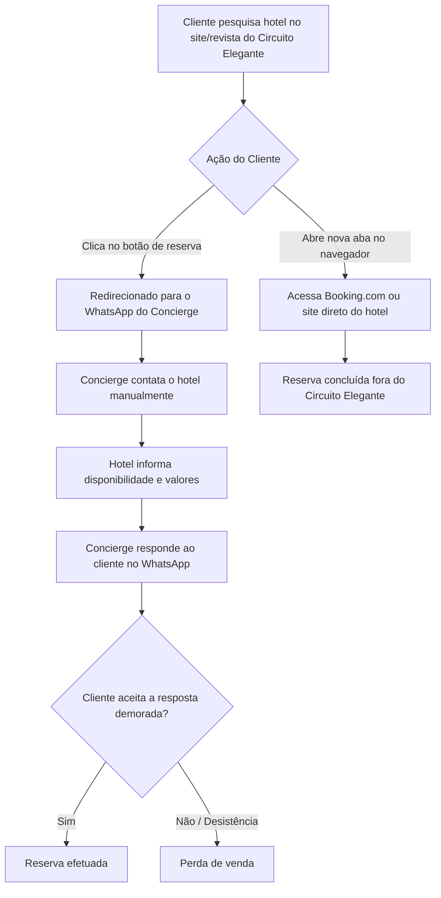

# Fluxos encontrados

- Reunião: Adapta Native - Circuito Elegante
- Data: 2026-08-12
- Link tl;dv: https://tldv.io/app/meetings/6a7c6052d5507e0013ffdf4a
- Fonte: transcrição e metadados retornados pela API do tl;dv.

## Observação
O fluxo abaixo descreve o processo atual de atendimento e fechamento de reservas, identificando os pontos de perda de cliente.

## Processo de Reserva de Hóspedes (atual)

