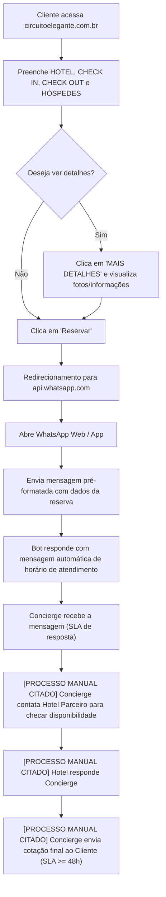

# Análise (IA) — Gravação de Tela 2026-08-25 às 18.05.52.mov

**Vídeo:** Gravação de Tela 2026-08-25 às 18.05.52.mov

**Processo:** Agendamento de reserva de hotel

---

Aqui está o relatório de auditoria operacional minucioso, mapeando, diagnosticando e medindo o processo apresentado no vídeo.

---

# RAIO-X INDIVIDUAL

**Empresa:** Circuito Elegante  
**Processo master:** Solicitação e Cotação de Reserva de Hospedagem  
**Vídeo:** Demonstração do Fluxo de Reservas via Site e WhatsApp  
**Executor:** Cliente (interface web) / Concierge (atendimento via WhatsApp) / Hotel Parceiro (retorno de disponibilidade)  
**Duração:** 01:53  
**Data:** [NÃO OBSERVÁVEL na gravação original; datas testadas na reserva: 25/08/2026 a 26/08/2026]  

### Resumo Executivo
O processo compreende a navegação de um cliente pelo site do Circuito Elegante, preenchimento dos parâmetros de hospedagem e redirecionamento automatizado para o WhatsApp da empresa. A partir do envio da mensagem pelo cliente, o fluxo perde a automação: um concierge interno precisa contatar manualmente o hotel parceiro para verificar disponibilidade/valores e responder ao cliente. O gargalo principal é o tempo de resposta de no mínimo 48 horas devido a essa intermediação manual. A maior oportunidade reside na integração direta de motor de reservas/API de disponibilidade dos hotéis parceiros.

---

# 2. DESCRIÇÃO NARRATIVA DO SISTEMA (PARA LEIGO)

O sistema de reservas do **Circuito Elegante** (hospedado no domínio `https://www.circuitoelegante.com.br`) opera como um vitrine de hotéis de luxo/boutique e um gerador de solicitações de cotação enviadas diretamente para o canal corporativo no **WhatsApp Web / WhatsApp App** (`https://api.whatsapp.com` / `https://web.whatsapp.com`).

### 1. Tela Inicial e Motor de Busca (`https://www.circuitoelegante.com.br`)
A tela inicial apresenta um carrossel institucional e um formulário fixo de pesquisa de disponibilidade com quatro campos principais:
*   **`HOTEL`** (Campo de texto livre com autocompletar): O cliente digita o nome de um hotel, cidade ou região. No vídeo, ao digitar `"campos do j"`, o sistema exibe um menu suspenso com opções correspondentes (ex.: *Figueira da Serra Pousada Boutique*, *Botanique Hotel Experience*, *Hotel Boutique Quebra-Noz*).
*   **`CHECK IN`** (Campo de data): Seleção da data de entrada. No vídeo: `25/08/2026`.
*   **`CHECK OUT`** (Campo de data): Seleção da data de saída. No vídeo: `26/08/2026`.
*   **`HÓSPEDES`** (Menu suspenso / Dropdown): Seleção da quantidade e tipo de ocupantes. No vídeo: `2 adultos`.
*   **`Reservar`** (Botão de ação verde): Processa os dados informados e redireciona para o canal de atendimento.
*   **`MAIS DETALHES`** (Link/Botão secundário): Abre a página descritiva do hotel selecionado.

### 2. Página de Detalhes do Hotel (`https://www.circuitoelegante.com.br/hoteis/...`)
Ao selecionar um hotel e clicar em `MAIS DETALHES`, o usuário é direcionado para a página específica da propriedade (no exemplo: `Figueira da Serra Pousada Boutique`). 
*   A página apresenta seções informativas: `SOBRE`, `BENEFÍCIOS E EXPERIÊNCIAS`, `ACOMODAÇÕES`, `FOTOS` e `LOCALIZAÇÃO`.
*   Há um bloco de reserva mantido no topo da página com os mesmos campos (`HOTEL`, `CHECK IN`, `CHECK OUT`, `HÓSPEDES`) e o botão **`Reservar`**.

### 3. Redirecionamento e Comunicação via WhatsApp (`api.whatsapp.com` / `web.whatsapp.com`)
Ao clicar no botão **`Reservar`**, o site não realiza cobrança nem confirma a reserva em tempo real. Em vez disso, gera um link parametrizado para a API do WhatsApp para o número de atendimento da empresa (`+55 21 99706-4850`), preenchendo automaticamente a seguinte estrutura de mensagem:

> *"Olá! Estava conhecendo o [Nome do Hotel] pelo site do Circuito Elegante e gostaria de receber uma cotação para minha hospedagem. Dados da reserva: - Hotel: [Nome do Hotel] - Check-in: [Data] - Check-out: [Data] - Hóspedes: [Quantidade]"*

### 4. Regras de Negócio Explicadas
1.  **Ausência de Motor de Reserva Transacional Direct-to-Consumer (DTC):** O site não consulta banco de dados de disponibilidade dos hotéis em tempo real; ele atua puramente como captador de leads/solicitações.
2.  **Horário de Atendimento Comercial:** O atendimento via WhatsApp conta com mensagem automática de ausência/boas-vindas informando o horário de funcionamento: **segunda a sexta-feira, das 9h às 17h**.
3.  **Fluxo de Intermediação Triangulada (Concierge):** 
    *   O cliente envia a mensagem pelo WhatsApp.
    *   O Concierge do Circuito Elegante recebe a demanda.
    *   O Concierge entra em contato com a equipe de reservas do hotel parceiro (por telefone/e-mail/sistema próprio do hotel) para checar tarifas e disponibilidade.
    *   Após o retorno do hotel, o Concierge formata a proposta e a envia de volta ao cliente.
4.  **SLA de Atendimento:** Conforme informado verbalmente pela executiva (Manuela Porode), o tempo total desse fluxo de retorno ao cliente leva **no mínimo 48 horas**.

---

# 3. MAPEAMENTO E FLUXO

### Tabela Passo a Passo

| # | Timestamp | Atividade | Responsável | Sistema/Ferramenta | Tipo | Tempo | VA/BVA/NVA | Observações |
|---|---|---|---|---|---|---|---|---|
| 1 | 00:00 | Apresentação inicial da executiva e do objetivo da demonstração | Executivo (Marketing) | Google Chrome | Ação | 00:15 | NVA | Apresentação institucional de Manuela Porode. |
| 2 | 00:15 | Navegação na home page do site Circuito Elegante | Cliente | Google Chrome (`circuitoelegante.com.br`) | Ação | 00:08 | BVA | Leitura visual de ofertas e opções de busca. |
| 3 | 00:23 | Digitação de destino no campo `HOTEL` (`campos do j`) e seleção do hotel | Cliente | Google Chrome (`circuitoelegante.com.br`) | Ação | 00:15 | BVA | Autocompletar exibe hotéis de Campos do Jordão/SP; selecionado *Figueira da Serra Pousada Boutique*. |
| 4 | 00:38 | Definicação dos parâmetros de busca (`CHECK IN`: 25/08/2026, `CHECK OUT`: 26/08/2026, `HÓSPEDES`: 2 adultos) | Cliente | Google Chrome (`circuitoelegante.com.br`) | Ação | 00:03 | BVA | Preenchimento dos dados operacionais da reserva. |
| 5 | 00:41 | Clique em `MAIS DETALHES` e navegação pela página do hotel | Cliente | Google Chrome (`circuitoelegante.com.br`) | Ação | 00:10 | BVA | Carregamento da página específica da pousada. |
| 6 | 00:51 | Clique no botão `Reservar` | Cliente | Google Chrome (`circuitoelegante.com.br`) | Ação | 00:03 | BVA | Disparo do link `api.whatsapp.com`. |
| 7 | 00:54 | Transição de tela e abertura da API do WhatsApp no navegador | Cliente | API WhatsApp / WhatsApp Web | Handoff | 00:16 | NVA | Interface intermediária de confirmação do navegador. |
| 8 | 01:10 | Carregamento da conversa no WhatsApp Web com mensagem pré-formatada | Cliente | WhatsApp Web | Espera | 00:15 | NVA | Inicialização e carregamento da sessão do WhatsApp Web. |
| 9 | 01:25 | Envio da mensagem de solicitação de cotação pelo cliente | Cliente | WhatsApp Web | Handoff | 00:03 | BVA | Mensagem com dados da reserva enviada para a conta comercial. |
| 10 | 01:28 | Disparo e recebimento da resposta automática do bot do WhatsApp | Sistema (Bot) | WhatsApp Web | Ação | 00:03 | BVA | Mensagem automática informando horário de atendimento (9h às 17h). |
| 11 | 01:31 | Explicação verbal do processamento interno (envio manual da solicitação ao hotel e retorno ao cliente em 48h+) | Concierge / Hotel Parceiro | WhatsApp / E-mail / Telefone [NÃO OBSERVÁVEL] | Espera / Handoff | ~48h00m (declarado) | NVA | Intermediação manual entre Concierge e Hotel parceiro antes de responder ao cliente. |

---

### Listas Complementares de Fluxo

*   **Pontos de decisão:**
    *   *Decisão no site (00:41):* Navegar em `MAIS DETALHES` para ver informações da propriedade OU clicar direto em `Reservar`.
    *   *Decisão de canal (00:54):* Abrir aplicativo Desktop do WhatsApp OU `Continuar para o WhatsApp Web`.
*   **Handoffs:**
    *   *Handoff 1 (00:51 → 01:10):* Do Web Site do Circuito Elegante para a plataforma WhatsApp Web (transferência de contexto via parâmetros de URL).
    *   *Handoff 2 (01:25 → 01:28):* Do Cliente para o Canal de Atendimento Circuito Elegante via mensagem de WhatsApp.
    *   *Handoff 3 [NÃO MOSTRADO, CITADO em 01:31]:* Do Concierge do Circuito Elegante para a equipe de Reservas do Hotel parceiro (solicitação manual de tarifário/disponibilidade).
    *   *Handoff 4 [NÃO MOSTRADO, CITADO em 01:31]:* Da equipe de Reservas do Hotel parceiro de volta ao Concierge do Circuito Elegante.
    *   *Handoff 5 [NÃO MOSTRADO, CITADO em 01:31]:* Do Concierge do Circuito Elegante de volta ao Cliente final com a cotação.
*   **Regras de negócio implícitas:**
    *   `RN-01 (00:23)`: O campo `HOTEL` realiza filtragem dinâmica por string contida na cidade, região ou nome fantasia.
    *   `RN-02 (00:51)`: A solicitação não garante reserva ou bloqueio de apartamento; funciona como pedido de cotação assíncrono.
    *   `RN-03 (01:28)`: Mensagens enviadas fora do horário comercial (ou na chegada do lead) recebem mensagem padrão automatizada informando o horário de expediente (2ª a 6ª das 9h às 17h).
    *   `RN-04 (01:31)`: As cotações enviadas aos hotéis dependem de checagem humana individual pelo Concierge, estabelecendo um SLA operacional mínimo de 48 horas.
*   **Exceções:**
    *   *Solicitações enviadas fora do horário comercial ou em finais de semana:* Ficam retidas na fila do WhatsApp sem atendimento humano até a abertura do próximo dia útil (explicado na mensagem automática de 01:28).

---

### Fluxograma (Mermaid)



---

# 4. DIAGNÓSTICO

### Tabela de Problemas Operacionais

| Timestamp | Problema | O que foi observado | Impacto (tempo/qualidade/risco) | Severidade | Causa-raiz provável |
|---|---|---|---|---|---|
| 00:51 - 01:31 | Ausência de integração/motor de reservas em tempo real | O botão `Reservar` abre um WhatsApp em vez de confirmar/exibir disponibilidade e preço imediatos. | **Crítico.** Provoca atrito e abandono de funil. Clientes de luxo esperam confirmação imediata. | **Alta** | Arquitetura de TI desacoplada dos sistemas de PMS/Channel Manager dos hotéis parceiros. |
| 01:31 | Gargalo de SLA de atendimento (48h+) | A executiva declara: *"O concierge recebe essa mensagem, só que ele tem 48h para responder... isso demora no mínimo 48h"*. | **Crítico.** Altíssima taxa de perda de conversão. Em 48h o cliente reserva por OTAs concorrentes (Booking, Hoteis.com, site direto do hotel). | **Alta** | Dependência de pontes de contato 100% manuais entre Concierge e Hotel. |
| 01:28 | Restrição de horário de atendimento | Mensagem automática limita atendimento ao horário de 2ª a 6ª, das 9h às 17h. | **Médio.** Leads gerados à noite ou nos finais de semana ficam represados por dias. | **Média** | Operação de atendimento estritamente humana sem equipe de plantão/turno. |
| 00:54 - 01:10 | Fricção no redirecionamento do navegador para o WhatsApp | O usuário precisa passar por diálogos de confirmação de abertura de aplicativo ou escolher o WhatsApp Web. | **Baixo.** Perda marginal de conversão por fricção de UX. | **Baixa** | Limitação de navegação padrão de APIs de deep link de terceiros (WhatsApp/Meta). |

---

### Gargalo Principal do Processo (Teoria das Restrições)
O **gargalo restritivo** deste processo é o **tempo de resposta no fluxo de triagem humana (Concierge $\leftrightarrow$ Hotel Parceiro)**. 
A empresa atua como uma intermediária manual de comunicação. Como o site não consulta a disponibilidade real das propriedades em tempo real, cada pedido gera 3 tarefas humanas sequenciais e síncronas/assíncronas (Concierge ler WhatsApp $\rightarrow$ Concierge contactar hotel $\rightarrow$ Hotel checar mapa de ocupação e responder $\rightarrow$ Concierge formatar proposta $\rightarrow$ Envio ao cliente). Isso infla o tempo de ciclo total para **48 horas ou mais**, destruindo a eficiência do funil de vendas digital.

---

### Oportunidades Óbvias de Melhoria

1.  **Conexão API / Channel Manager com Hotéis Parceiros (Maior Benefício ÷ Menor Esforço):**
    *   *Ação:* Integrar o site a motores de reserva / gestores de canais (Channel Managers como Omnibees, Stays, Cloudbeds).
    *   *Problema resolvido:* Elimina a necessidade de consultar o hotel via WhatsApp (timestamp 01:31).
    *   *Ganho estimado:* Redução do Lead Time de cotação de 48 horas para **menos de 3 segundos** (instantâneo).
2.  **Automação de Consulta via IA / Chatbot de Concierge Integrado:**
    *   *Ação:* Caso a integração de API de PMS não seja viável imediatamente para todos os hotéis, implementar um robô de atendimento no WhatsApp integrado a um banco de dados de tarifário pré-carregado ou que envie um formulário automatizado direto para o setor de reservas do hotel.
    *   *Problema resolvido:* Mensagem de ausência e espera por atendimento humano em horário comercial (01:28).
    *   *Ganho estimado:* Resposta inicial e pré-cotação automatizada em **menos de 5 minutos**.
3.  **Captura Direct-on-Site (Formulário Web em vez de redirecionar para WhatsApp):**
    *   *Ação:* Permitir a inclusão do e-mail/telefone do cliente diretamente em um formulário na página do hotel no site, disparando o e-mail de cotação de forma automatizada.
    *   *Problema resolvido:* Fricção no redirecionamento para o WhatsApp Web (00:54).
    *   *Ganho estimado:* Redução da fricção de UX e captura do lead mesmo que o cliente não tenha/não queira usar o WhatsApp Web no desktop.

---

# 5. MÉTRICAS (BASELINE DESTE VÍDEO)

Todas as métricas foram calculadas estritamente a partir das evidências do vídeo ou das declarações explícitas da executiva:

*   **Lead Time Total do Processo (Observado + Declarado):** `~48 horas a 72 horas` (com base na declaração expressa em 01:31: *"demora no mínimo 48h"*).
*   **Touch Time / Tempo de Execução do Cliente no Vídeo (Observado):** `01:25` (de 00:00 até o envio da mensagem no WhatsApp em 01:25).
*   **Tempo de Espera Ativo / Inatividade no Vídeo (Observado):** `00:28` (tempo entre os carregamentos de tela, transição para a API do WhatsApp e abertura do WhatsApp Web entre 00:51 e 01:19).
*   **Tempo de Retrabalho (Observado):** `00:00` (nenhum erro de digitação ou necessidade de correção foi observado durante a gravação).
*   **Process Cycle Efficiency (PCE):** 
    $$\text{PCE} = \frac{\text{Touch Time}}{\text{Lead Time Total}} = \frac{85\text{ segundos}}{172.800\text{ segundos (48h)}} \approx 0,049\%$$
    *(Indica um processo extremamente ineficiente, onde 99,95% do tempo total de vida da solicitação é desperdício de espera).*
*   **Nº de Handoffs (Observados + Citados):** `5` (Cliente $\rightarrow$ Site/WhatsApp $\rightarrow$ Concierge $\rightarrow$ Hotel $\rightarrow$ Concierge $\rightarrow$ Cliente).
*   **Nº de Sistemas Distintos Utilizados:** `3` (Google Chrome / Site Circuito Elegante, API WhatsApp, WhatsApp Web).
*   **Nº de Etapas Manuais:** `4` (Preenchimento pelo cliente no site, envio da mensagem no WhatsApp, consulta manual do Concierge ao hotel, resposta do Concierge ao cliente).

---

# 6. SINAIS PARA A CONSOLIDAÇÃO

*   **Conexões prováveis com outros processos:**
    *   Processo de Atendimento de Concierge (Recebimento de mensagens no WhatsApp corporativo).
    *   Processo de Negociação/Checagem de Disponibilidade com Hotéis Parceiros.
    *   Processo de Fechamento de Reserva e Faturamento/Comissionamento.
*   **Processos citados mas não demonstrados no vídeo:**
    *   *"O concierge recebe essa mensagem..."* $\rightarrow$ Gestão de fila de atendimento do concierge.
    *   *"Ele vai mandar essa solicitação pro hotel..."* $\rightarrow$ Comunicação B2B entre Circuito Elegante e hotel parceiro.
    *   *"Quando ele tiver o retorno do hotel, ele vai mandar pro cliente..."* $\rightarrow$ Elaboração e envio de proposta comercial de hospedagem.
*   **Perguntas em aberto para o Customer Success (CS):**
    *   Como o Concierge entra em contato com o hotel parceiro (E-mail, telefone, extranet, WhatsApp)? `[INFERÊNCIA / NÃO OBSERVÁVEL em 01:31]`
    *   Existe alguma planilha ou sistema de CRM onde essas solicitações vindas do WhatsApp são registradas para controle de funil? `[NÃO OBSERVÁVEL]`
    *   Qual a taxa de conversão atual das solicitações que aguardam 48 horas por uma resposta? `[NÃO OBSERVÁVEL]`

---

# 7. BLOCO DE DADOS ESTRUTURADO

```yaml
sistemas_citados: ["Google Chrome", "circuitoelegante.com.br", "api.whatsapp.com", "WhatsApp Web"]
handoffs: 
  - {de: "Cliente", para: "Site Circuito Elegante", item: "Parâmetros de busca da reserva", timestamp: "00:38"}
  - {de: "Site Circuito Elegante", para: "WhatsApp Web", item: "Mensagem pré-formatada com dados da reserva", timestamp: "00:51"}
  - {de: "Cliente", para: "Concierge Circuito Elegante", item: "Envio do mensagem de solicitação de cotação", timestamp: "01:25"}
  - {de: "Concierge Circuito Elegante", para: "Setor de Reservas do Hotel Parceiro", item: "Pedido manual de tarifário e disponibilidade", timestamp: "01:31"}
  - {de: "Setor de Reservas do Hotel Parceiro", para: "Concierge Circuito Elegante", item: "Confirmação de vaga e preço", timestamp: "01:31"}
  - {de: "Concierge Circuito Elegante", para: "Cliente", item: "Proposta/Cotação final de hospedagem", timestamp: "01:31"}
gargalo_principal: "Intermediação manual de cotação entre Concierge e Hotel Parceiro gerando SLA de resposta de no mínimo 48 horas"
conexoes_provaveis: ["Atendimento de Vendas/Concierge via WhatsApp", "Gestão de Reservas B2B com Hotéis Parceiros", "Cobrança/Faturamento de Comissões"]
processos_citados_nao_mostrados: ["Checagem manual de disponibilidade junto ao hotel", "Envio da proposta comercial final ao cliente"]
perguntas_abertas_cs: 
  - "Qual o meio de comunicação padronizado entre o Concierge e o Hotel parceiro? — [NÃO OBSERVÁVEL em 01:31]"
  - "Qual o volume diário de leads recebidos via WhatsApp e a taxa de desistência por conta do SLA de 48h? — [NÃO OBSERVÁVEL em 01:31]"
metricas_baixa_confianca: []
```
